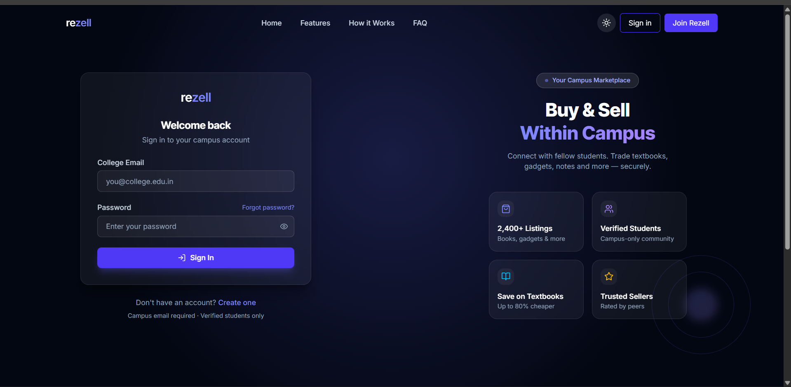
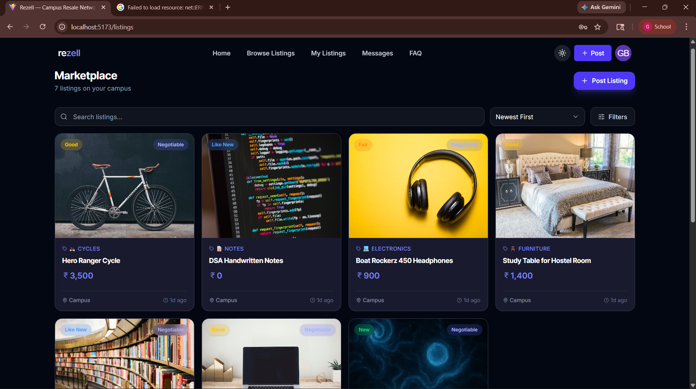
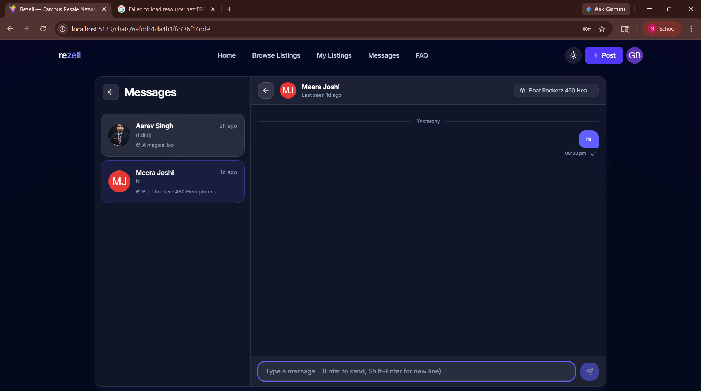
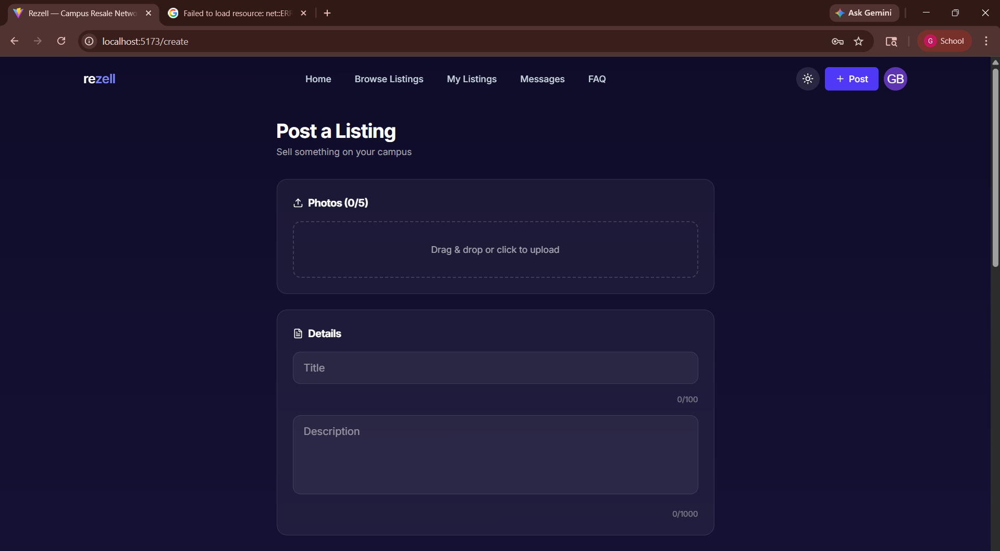
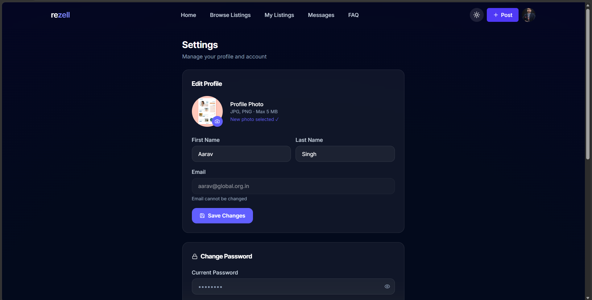
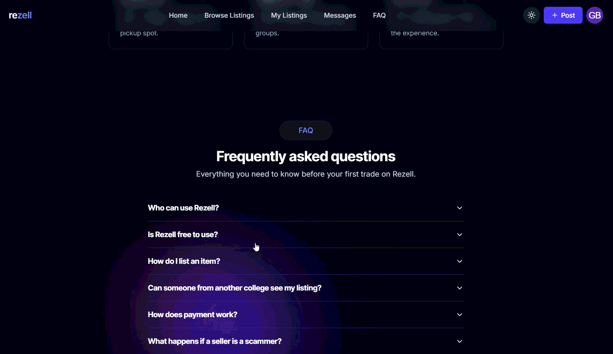

<div align="center">

<!-- ═══════════════════════════════════════════════════════════ -->
<!--                     HERO BANNER                           -->
<!-- Replace with: docs/assets/rezell-banner.png               -->
<!-- Suggested size: 1200×400px, dark background, logo center  -->
<!-- ═══════════════════════════════════════════════════════════ -->

<!--  -->

# 🛒 Rezell

### *"Re-use. Re-sell. Rezell."*

**A college-exclusive marketplace where students buy & sell second-hand items — securely, locally, and with trust.**

<br/>

[](https://github.com/Guru54/rezell)
[](https://github.com/Guru54/rezell)
[](https://nodejs.org)
[](LICENSE)
[](CONTRIBUTING.md)

<br/>

[🌐 Live Demo](#) &nbsp;•&nbsp; [📖 Docs](#-getting-started) &nbsp;•&nbsp; [🐛 Report Bug](https://github.com/Guru54/rezell/issues) &nbsp;•&nbsp; [💡 Feature Request](https://github.com/Guru54/rezell/issues)

</div>

---

## 📌 Table of Contents

- [About](#-about-rezell)
- [Problem Statement](#-problem-statement)
- [Screenshots](#-screenshots)
- [Core Features](#-core-features)
- [Tech Stack](#️-tech-stack)
- [System Architecture](#-system-architecture)
- [Project Structure](#-project-structure)
- [Getting Started](#-getting-started)
- [Environment Variables](#-environment-variables)
- [API Overview](#-api-overview)
- [Roadmap](#️-roadmap)
- [Interview Summary](#-interview-ready-summary)
- [Author](#-author)

---

## 🧠 About Rezell

**Rezell** is a college-exclusive digital marketplace designed to replace unsafe, unstructured buying and selling through WhatsApp groups and hostel notice boards.

> **OLX for your campus — but smarter, safer, and built for students.**

This is **not a CRUD application**. Every feature is driven by real student behaviour — trust mechanics, campus isolation, chat-based negotiation, and a rating system that only unlocks after a genuine transaction.

---

## ❗ Problem Statement

Indian college students rely on scattered, unsafe channels for campus commerce:

| Problem | Real Impact |
|:--------|:------------|
| ❌ No identity verification | Scams, fake sellers, ghost listings |
| ❌ No search or structure | Time wasted scrolling hundreds of messages |
| ❌ Old / expired posts | Confusion, duplicate inquiries |
| ❌ Outsiders can access groups | Unsafe meetups, spam |
| ❌ No local focus | Furniture, cycles can't be sold to strangers far away |

**Solution:** A structured, campus-exclusive, trust-first marketplace — **Rezell**.

---

## 📸 Screenshots


<!-- Recommended tool: use your browser + Screely.com to frame -->


<div align="center">

| 🔐 Auth & OTP | 🏠 Listings Feed | 💬 Real-Time Chat |
|:---:|:---:|:---:|
|  |  |  |
| *College email verification* | *Campus-isolated marketplace* | *Socket.io negotiation* |

| 📦 Create Listing | 👤 Seller Profile | ⭐ Rating System |
|:---:|:---:|:---:|
|  |  |  |
| *Cloudinary image upload* | *Trust score & history* | *Transaction-gated reviews* |

</div>

> 💡 **Demo GIF** — 
 

---

## ✨ Core Features

### 🔐 Campus-Only Authentication

> *"If your email isn't from this campus, you're not getting in."*

- **OTP Email Verification** — Users verified before account creation
- **Domain-Based Isolation** — Email domain extracted and matched against college registry; outsiders blocked at the auth layer
- **JWT + HTTP-Only Cookies** — Token carries `{ userId, role, college }` — every request scoped to user's institution
- **Account Lockout** — 5 failed login attempts triggers a 15-minute lock with audit logging
- **Audit Trail** — Every auth event (register, login, OTP verify, lock) logged to `AuditLog` collection

---

### 📦 Dynamic Product Listings

- **Categories:** Books · Gadgets · Furniture · Miscellaneous
- **Condition Tags:** New · Like New · Good · Fair
- **Negotiable Pricing** — Flexible price flag for open negotiation
- **Cloudinary Integration** — Optimized image upload via Multer pipeline
- **Campus Scope** — Listings auto-tagged to seller's college; buyers only see their own campus
- **Listing Lifecycle** — `Active → Sold → Expired → Archived` with cron-based auto-expiry *(Phase 6)*

---

### 💬 Real-Time Chat & Negotiation

- **Socket.io** — Persistent WebSocket connections per college room
- **In-App Negotiation** — Price discussion and pickup coordination without exposing phone numbers
- **Live Indicators** — Typing indicator, online presence, unread message count
- **No Contact Exposure** — Communication stays fully in-platform

---

### ⭐ Seller Rating & Trust System *(Phase 5)*

> *"Trust that can't be faked — because the system won't allow it."*

Ratings are **behaviorally enforced**, not just form-validated:

| Condition | Enforcement |
|:----------|:------------|
| ✅ Rating only after real transaction | `listing.status === 'sold'` AND `listing.buyer === ratingUser` |
| ✅ One rating per listing per buyer | Compound unique index on `{ listing, buyer }` |
| ✅ Self-rating impossible | `seller._id !== req.user._id` check in service layer |
| ✅ Fake rating prevention | Verified chat history between buyer & seller on that listing must exist |


---

### 🎓 Student Lifecycle Handling *(Phase 6)*

| Account State | Permissions |
|:---|:---|
| Active Student | Buy + Sell |
| Pass-Out (Grace Period) | Sell Only — clear hostel before leaving |
| Expired Alumni | Account archived, listings deactivated |

---

## 💳 Payment Philosophy

> **No forced in-app payment — intentionally.**

Students on the same campus prefer **cash on pickup** or **direct UPI transfer**. Rezell provides **discovery + trust + communication** — not payment processing.

This is a **design maturity decision**, not a limitation. Avoiding payments means:
- ✅ No RBI/PCI compliance complexity
- ✅ No escrow edge cases
- ✅ Matches how students actually transact in real life

---

## 🛠️ Tech Stack

<div align="center">

| Layer | Technology | Purpose |
|:------|:-----------|:--------|
| **Frontend** | React.js (Vite) + Tailwind CSS | UI framework |
| **Animations** | Framer Motion + Lenis | Micro-interactions & scroll |
| **Backend** | Node.js + Express.js | REST API server |
| **Database** | MongoDB + Mongoose | Document store |
| **Auth** | JWT + Bcrypt + Nodemailer | Secure auth & OTP |
| **Real-Time** | Socket.io | WebSocket chat |
| **File Storage** | Cloudinary + Multer | Image upload & CDN |
| **Security** | Helmet + express-rate-limit + mongo-sanitize | Hardened backend |
| **Deployment** | Vercel + Render + MongoDB Atlas | Cloud hosting |

</div>

---

## 🗺️ System Architecture

### Auth & Campus Isolation Flow

```
POST /api/auth/register  (college email)
          │
          ▼
  Extract email domain ──► Match against College.domain in DB
          │                       │
          │              ✗ Mismatch → 400 "Use official email"
          │
          ▼
  Hash password + Generate OTP ──► Send via Nodemailer
          │
          ▼
  User saved (isVerified: false)
          │
POST /api/auth/verify-otp
          │
          ▼
  OTP valid + not expired?
          │
          ▼
  isVerified = true ──► Sign JWT { userId, role, college }
          │
          ▼
  Every subsequent request ──► collegeCheck middleware
                                     │
                               Reads college from JWT
                                     │
                         Only returns data for user's college ✅
```

### Buying Flow

```
Login → Browse (college-scoped) → View Listing → Check Seller Profile
  → Open Chat → Negotiate Price & Pickup → Meet on Campus
  → Pay (Cash/UPI) → Seller marks "SOLD" + tags Buyer
  → Buyer unlocks rating → Seller trust score updated
```

### Rating Unlock Flow

```
Seller marks listing SOLD + sets listing.buyer = buyerId
          │
          ▼
  Buyer visits listing ──► "Rate this seller" button visible
          │
          ▼
  Service validates 4 conditions (see Rating System)
          │
          ▼
  Rating saved ──► seller.avgRating recalculated ──► Profile updated
```

---

## 📁 Project Structure

```
rezell/
│
├── client/                          # React Frontend (Vite)
│   ├── public/
│   └── src/
│       ├── assets/                  # Static assets (images, fonts, icons)
│       ├── context/                 # Auth, Socket, Theme Contexts
│       ├── data/                    # Static constants / mock data
│       ├── features/                # Feature-based modular architecture
│       │   ├── auth/                # Login, Register, OTP flow
│       │   ├── chat/                # Real-time WebSocket chat
│       │   ├── home/                # Landing page
│       │   ├── listings/            # Marketplace feed, filters, detail view
│       │   ├── ratings/             # Rating submit + display (Phase 5)
│       │   └── profile/             # User dashboard, seller profile
│       ├── shared/                  # Global components, hooks, utils
│       └── App.jsx
│
├── server/                          # Express Backend
│   ├── src/
│   │   ├── config/                  # DB, Cloudinary, Email config
│   │   ├── controllers/             # Route handlers (thin layer)
│   │   ├── middleware/              # Auth guard, error handler, upload
│   │   ├── models/                  # Mongoose schemas
│   │   │   ├── User.js
│   │   │   ├── College.js
│   │   │   ├── Listing.js
│   │   │   ├── Chat.js
│   │   │   ├── Message.js
│   │   │   ├── Rating.js            # Phase 5
│   │   │   └── AuditLog.js
│   │   ├── routes/                  # Express route definitions
│   │   ├── services/                # Business logic (auth, listing, rating)
│   │   ├── socket/                  # Socket.io event handlers
│   │   ├── utils/                   # AsyncHandler, AppError, OTP, Logger
│   │   └── validations/             # Joi / express-validator schemas
│   ├── app.js                       # Express app config (middleware stack)
│   └── server.js                    # Entry point + Socket.io init
│
├── docs/
│   ├── assets/                      # Banner, demo GIF
│   ├── screenshots/                 # UI screenshots
│   └── RATING_SYSTEM.md             # Detailed rating implementation guide
│
└── README.md
```

---

## 🚀 Getting Started

### Prerequisites

- Node.js `>= 18.x`
- MongoDB Atlas account (free tier works)
- Cloudinary account (free tier works)
- Gmail account with App Password enabled (for Nodemailer OTP)

### Installation

```bash
# 1. Clone the repository
git clone https://github.com/Guru54/rezell.git
cd rezell

# 2. Backend setup
cd server
npm install
cp .env.example .env      # Fill in your values

# 3. Frontend setup
cd ../client
npm install
cp .env.example .env      # Fill in your values

# 4. Start development servers

# Terminal 1 — Backend
cd server && npm run dev

# Terminal 2 — Frontend
cd client && npm run dev
```

App runs at: `http://localhost:5173`

---

## 🔑 Environment Variables

### `server/.env`

```env
# ── Application ───────────────────────────────
PORT=5000
NODE_ENV=development

# ── Database ──────────────────────────────────
MONGODB_URI=mongodb+srv://<user>:<pass>@cluster.mongodb.net/rezell

# ── Authentication ────────────────────────────
JWT_SECRET=your_super_secret_key_min_32_chars
JWT_EXPIRES_IN=7d

# ── Cloudinary ────────────────────────────────
CLOUDINARY_CLOUD_NAME=your_cloud_name
CLOUDINARY_API_KEY=your_api_key
CLOUDINARY_API_SECRET=your_api_secret

# ── Email / OTP (Nodemailer) ──────────────────
SMTP_HOST=smtp.gmail.com
SMTP_PORT=587
SMTP_USER=your_email@gmail.com
SMTP_PASS=your_gmail_app_password   # Not your login password

# ── CORS ──────────────────────────────────────
CLIENT_URL=http://localhost:5173
```

### `client/.env`

```env
VITE_API_URL=http://localhost:5000/api
VITE_SOCKET_URL=http://localhost:5000
```

> ⚠️ **Never commit `.env` files.** Both are listed in `.gitignore`.

---

## 📡 API Overview

### Auth Routes — `/api/auth`

| Method | Endpoint | Description | Auth |
|:-------|:---------|:------------|:----:|
| `POST` | `/register` | Register with college email, sends OTP | ❌ |
| `POST` | `/verify-otp` | Verify OTP, returns JWT | ❌ |
| `POST` | `/login` | Login with lockout protection | ❌ |
| `POST` | `/logout` | Clear HTTP-only cookie | ✅ |

### Listing Routes — `/api/listings`

| Method | Endpoint | Description | Auth |
|:-------|:---------|:------------|:----:|
| `GET` | `/` | Get all listings (college-scoped) | ✅ |
| `POST` | `/` | Create new listing | ✅ |
| `GET` | `/:id` | Get listing detail | ✅ |
| `PATCH` | `/:id` | Update listing | ✅ Owner |
| `DELETE` | `/:id` | Delete listing | ✅ Owner |
| `PATCH` | `/:id/sold` | Mark as sold + set buyer | ✅ Owner |

### Rating Routes — `/api/ratings` *(Phase 5)*

| Method | Endpoint | Description | Auth |
|:-------|:---------|:------------|:----:|
| `POST` | `/` | Submit rating (4-condition validation) | ✅ |
| `GET` | `/seller/:userId` | Get seller's rating history | ✅ |

---

## 🗓️ Roadmap

```
✅ Phase 1 — Auth System
   └─ OTP verification, campus isolation, JWT, account lockout, audit logging

✅ Phase 2 — Listings
   └─ CRUD, Cloudinary upload, search & filtering, campus scoping

✅ Phase 3 — Frontend UI
   └─ Tailwind + Framer Motion, dark/light theme, mobile-first, Lenis scroll

✅ Phase 4 — Real-Time Chat
   └─ Socket.io, typing indicators, presence, unread counts

🔄 Phase 5 — Seller Ratings & Trust System
   └─ Transaction-gated ratings, fraud prevention, seller score

⏳ Phase 6 — Lifecycle & Admin
   └─ Auto-expiry (cron), pass-out student handling, admin panel

⏳ Phase 7 — Deployment
   └─ Vercel (FE) + Render (BE) + MongoDB Atlas
```

---

## 🧩 Key Engineering Decisions

| Decision | Rationale |
|:---------|:----------|
| College isolation at JWT level | Prevents data leakage even if middleware is bypassed |
| Service layer pattern | Controllers stay thin; business logic is testable independently |
| OTP before user creation | Prevents unverified email spam in the DB |
| No in-app payments | Avoids RBI compliance overhead; matches real student cash/UPI behavior |
| Rating gated behind transaction | Prevents fake reviews — no transaction, no voice |
| Socket.io rooms per college | Chat is college-scoped; no cross-campus message leakage |

---

## 🎯 Interview-Ready Summary

> *"Rezell is a college-exclusive reselling platform that replaces unstructured WhatsApp-based campus commerce. The architecture enforces campus isolation at the JWT level — every token carries a college ID, and all queries are scoped to that institution. The trust layer is behaviorally enforced: ratings only unlock when a listing is marked sold and the rater is verified as the actual buyer, with chat history as proof of genuine interaction. Real-time negotiation runs on Socket.io with college-scoped rooms. The system uses a service-layer architecture — controllers handle HTTP, services own business logic — making each layer independently testable. Payments are deliberately kept offline to reflect real student behaviour and avoid regulatory complexity."*

**Common interview questions & answers:**

<details>
<summary><strong>How does campus isolation work technically?</strong></summary>

Email domain is extracted at registration and matched against the `College` collection. The resulting `college` ObjectId is embedded in the JWT. A `collegeCheck` middleware reads this on every protected route and appends it to all DB queries — so a user from PCCOE can never query VIT's listings, even with a valid token.
</details>

<details>
<summary><strong>How do you prevent fake ratings?</strong></summary>

Four conditions must all pass in the rating service: listing must be `sold`, the requester must match `listing.buyer`, no prior rating from that buyer on that listing (compound unique index), and a `Chat` document between buyer and seller referencing that listing must exist. All four must pass — failing any throws an `AppError`.
</details>

<details>
<summary><strong>How does Socket.io scale?</strong></summary>

Currently single-server. For horizontal scaling, the Redis adapter (`@socket.io/redis-adapter`) enables pub/sub across multiple Socket.io instances — each server publishes events to Redis, and all servers receive them, maintaining consistent room state.
</details>

---

## 👨‍💻 Author

<div align="center">

<!-- Replace with your actual profile photo -->
<!--  -->

**Gurudas**
*Computer Engineering Student · MERN Stack Developer*

[](https://github.com/Guru54)
[](https://www.linkedin.com/in/gurudas-bhardwaj-5a428b277/)

</div>

---

<div align="center">

**Built with frustration, fixed with code.**
*Every feature exists because a student needed it.*

</div>